# Hubble - 业务监控平台

全链路业务监控平台，覆盖网关流量、异常检测、性能劣化、中间件监控、链路追踪、用户行为分析、业务监控等核心能力。

## 系统截图

### 网关概览
实时监控网关流量，展示总请求量、平均响应时间、错误率、QPS 四大核心指标，含请求趋势图和热门接口排名。

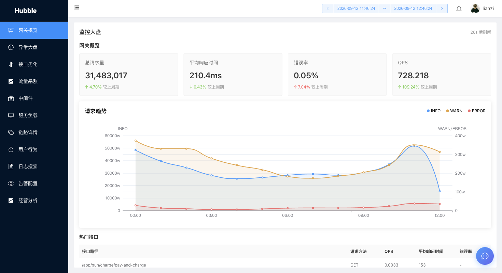

### 异常大盘
按分钟粒度展示各服务的异常事件分布，支持 15 分钟/30 分钟/1 小时时间粒度切换，快速定位异常服务。

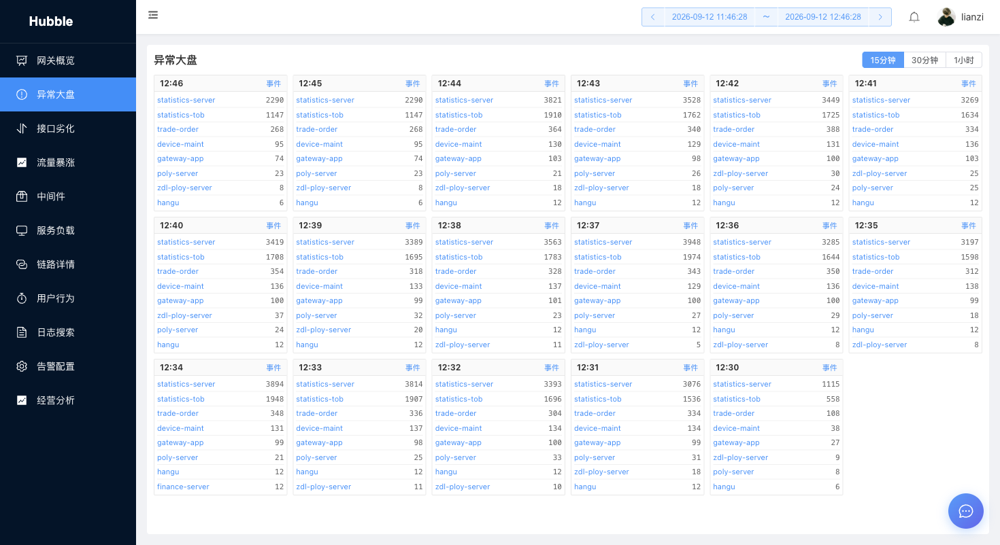

### 接口劣化
自动检测 P60 耗时劣化的接口，支持今天 vs 昨天、本周 vs 上周对比模式。点击下钻可查看该接口的链路详情。

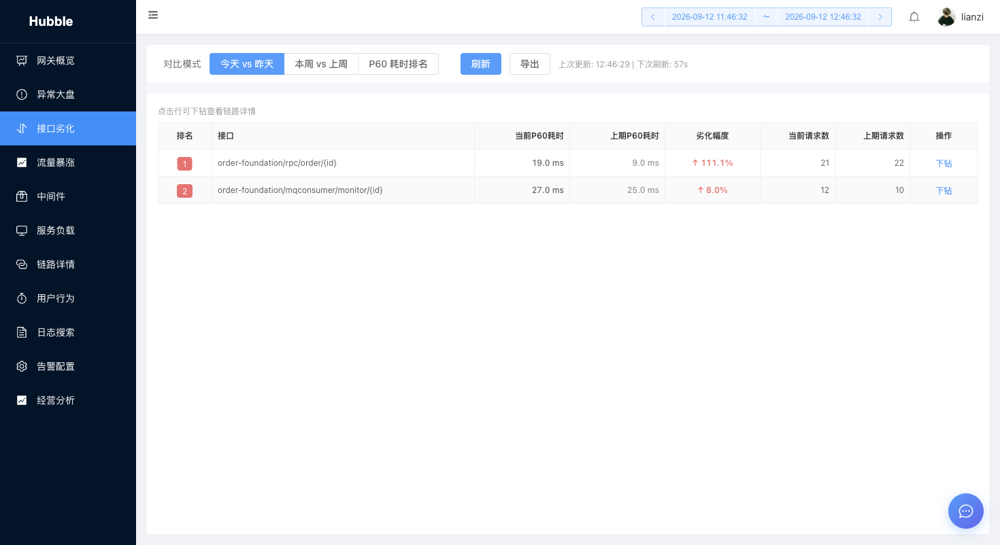

**下钻链路详情**：展示 TraceID、经过服务、服务数、总耗时、日志数、状态，点击可查看调用链完整日志。

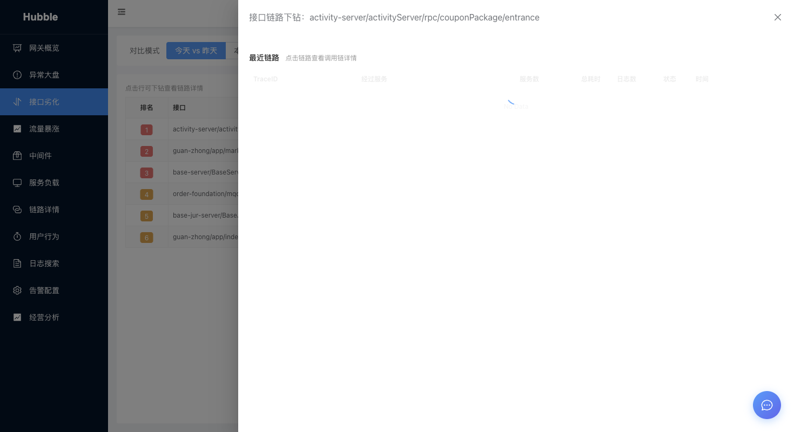

### 流量暴涨
检测接口流量异常暴涨，支持逐层下钻分析。

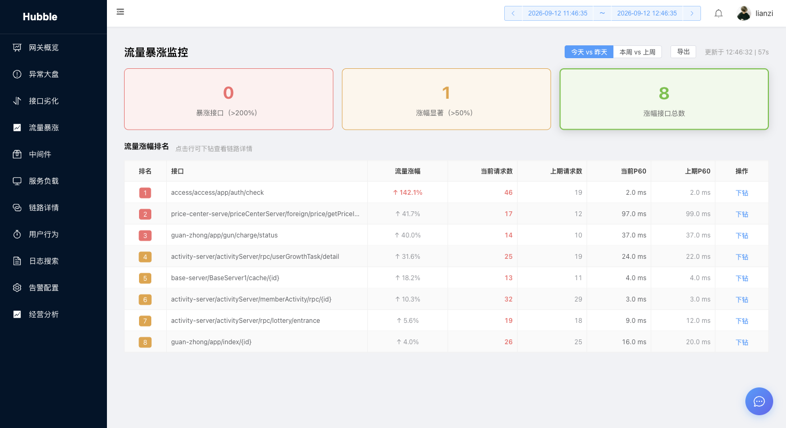

### 中间件
Redis 中间件监控，展示 Big Keys Top10 和慢查询 Top10，支持 Tab 切换。

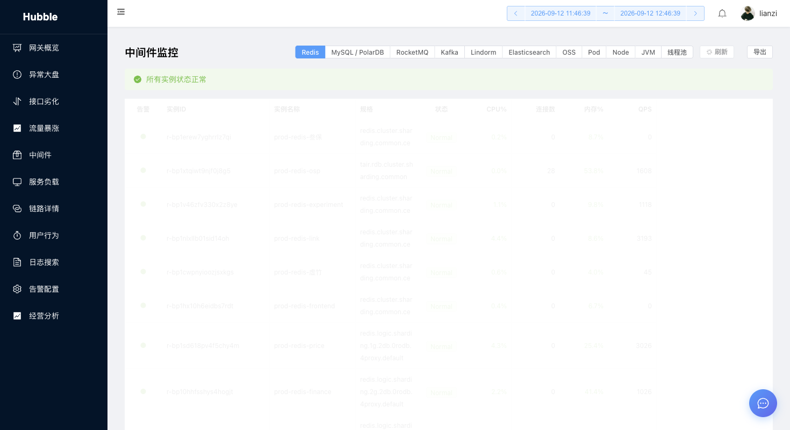

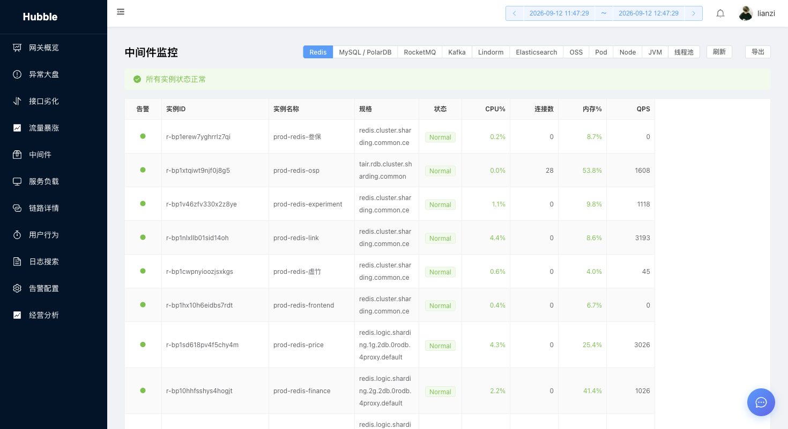

### 服务负载
服务资源负载监控，展示 CPU/内存使用率，含扩容阈值预警（CPU ≥ 80%/90%，内存 ≥ 85%/95%）。

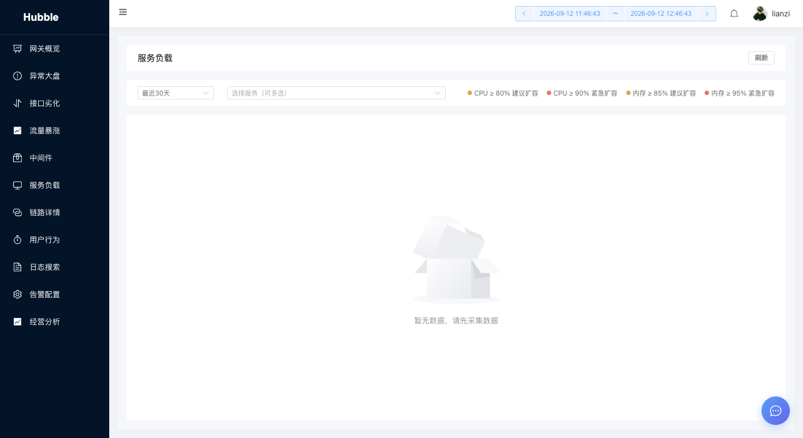

### 链路详情
按业务维度查询链路追踪数据，支持 TraceID 精确查询。

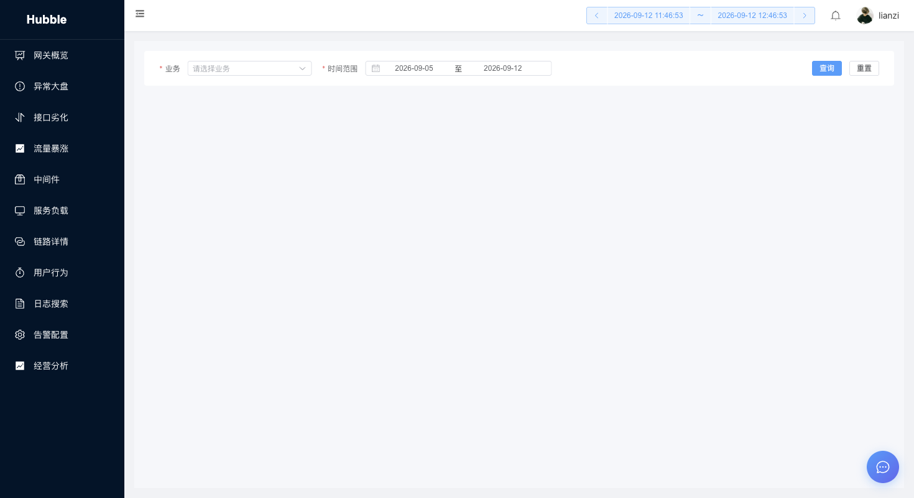

### 用户行为
通过手机号/用户ID 查询用户行为轨迹，展示时间、服务、页面名称、接口路径、终端、链路ID、响应状态、日志级别。支持链路下钻查看完整调用链和日志详情。

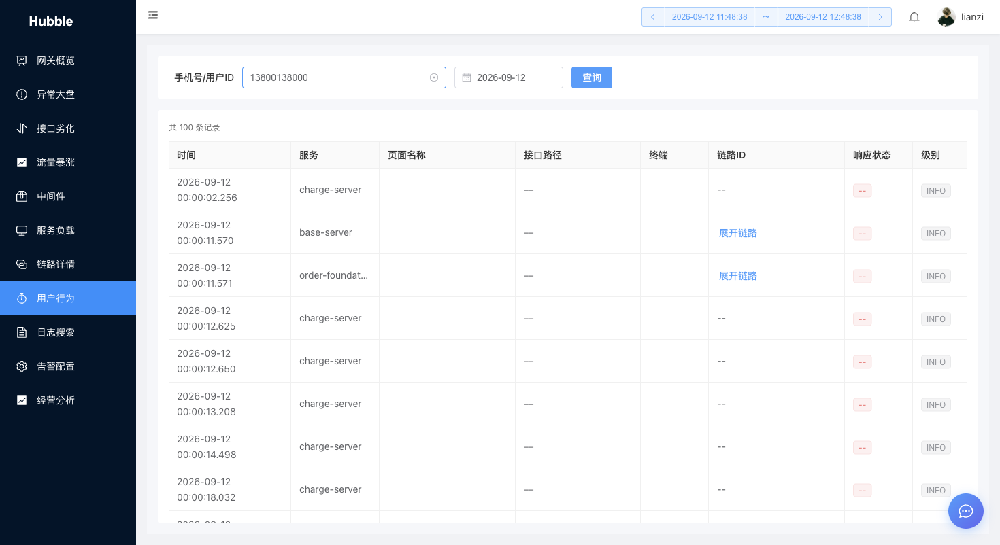

**链路下钻**：展示调用链各节点（服务名、状态、日志数），点击节点查看原始日志。


**日志详情**：展示日志级别、时间、原始日志内容（支持后端日志格式解析）。


### 日志搜索
关键字日志搜索，支持 Logstore 选择、时间范围筛选、排序方式切换，含快捷时间按钮。

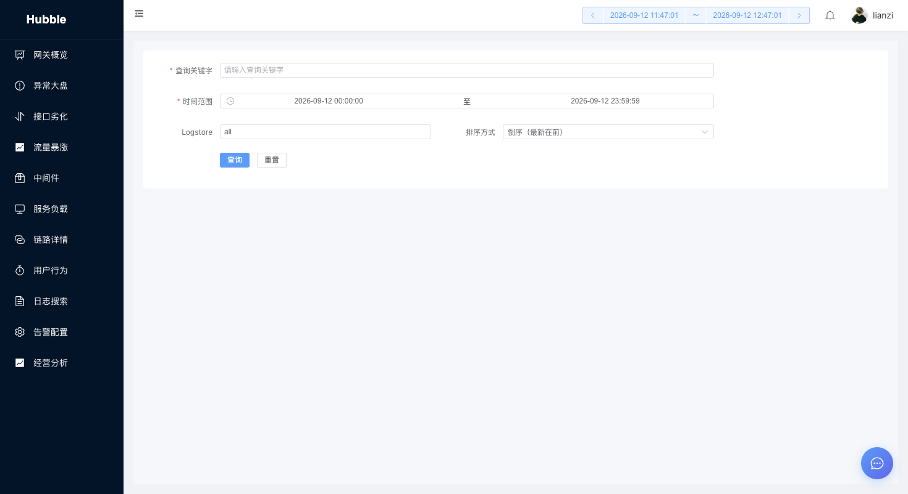

### 告警配置
日志监控告警配置，支持新建监控规则、配置告警机器人、独立开关控制每条规则。

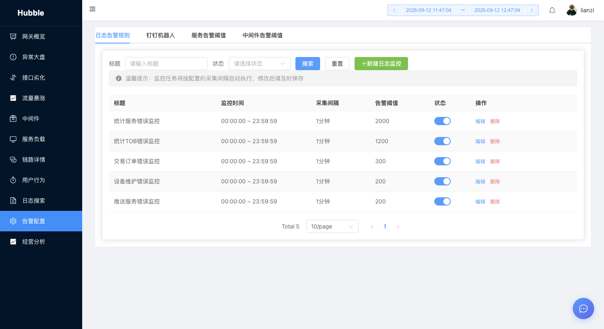

### 业务监控
业务经营数据全景分析，含 6 大指标卡（累计订单量、累计电量、枪总量、充电中枪数、小程序 DAU、广告点击数）、多维度图表（小时对比、月度趋势、年度同比、每日订单&电量、收入趋势、枪利用率、充电时段分布、DAU/MAU 趋势）、业务场景拆分、区域/站点排名 Top20。

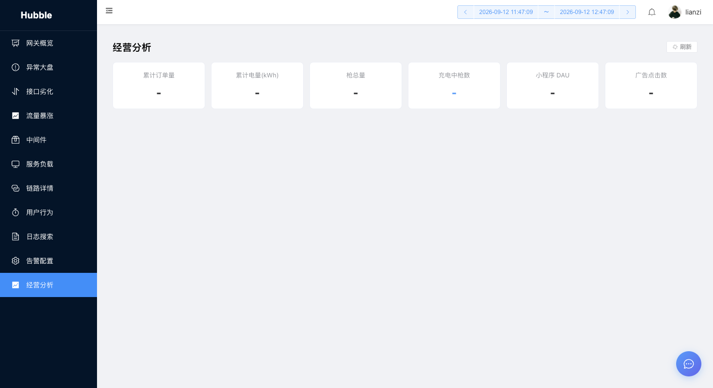

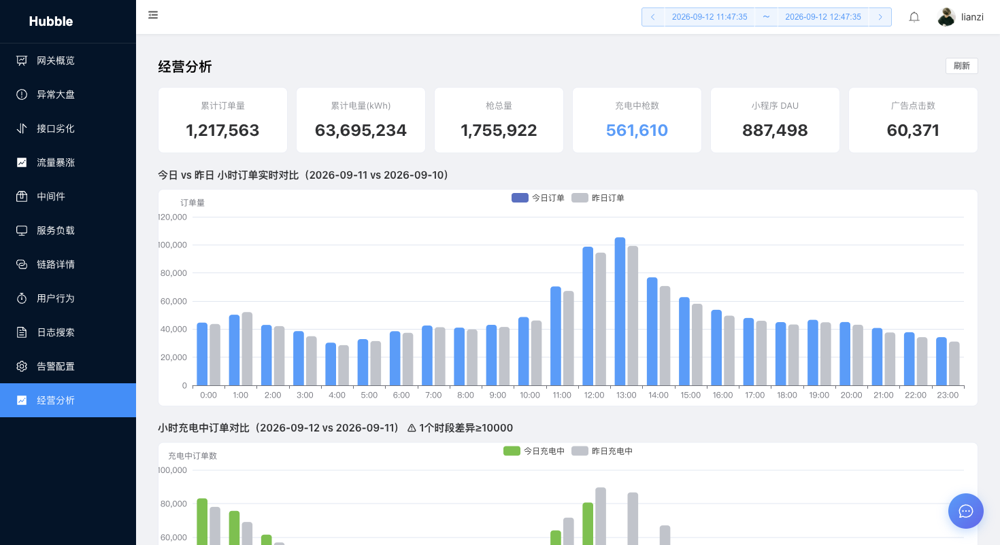


## 目录结构

```
hubble/
├── hubble-web/          # 前端 (Vue 3 + Vite + Element Plus + ECharts)
├── hubble-server/       # 后端 (Spring Boot 3 + Java 21 + MyBatis-Plus)
├── docs/
│   ├── screenshots/     # 系统截图（本 README 引用）
│   └── requirements/    # 需求文档 + 测试截图归档
├── build.sh             # 一键构建脚本
└── README.md
```

## 功能模块

| 模块 | 路由 | 说明 |
|------|------|------|
| 网关概览 | `/gateway` | 总请求量/QPS/错误率/响应时间 + 请求趋势图 + 热门接口 |
| 异常大盘 | `/abnormal` | 按分钟展示各服务异常事件，支持多时间粒度 |
| 接口劣化 | `/degradation-ranking` | P60 耗时劣化检测，支持对比模式 + 链路下钻 |
| 流量暴涨 | `/traffic-surge` | 接口流量异常检测 + 下钻分析 |
| 中间件 | `/middleware` | Redis Big Keys + 慢查询 Top10 |
| 服务负载 | `/service-load` | CPU/内存使用率 + 扩容阈值预警 |
| 链路详情 | `/trace-query` | 按业务/TraceID 查询调用链 |
| 用户行为 | `/user-behavior` | 手机号查询行为轨迹 + 链路下钻 + 日志详情 |
| 日志搜索 | `/keyword-log-query` | 关键字搜索 SLS 日志 |
| 告警配置 | `/alert-config` | 日志监控规则 + 机器人配置 |
| 业务监控 | `/biz-analysis` | 订单/电量/枪/DAU 全维度分析 |

## 开发模式

### 启动后端

```bash
cd hubble-server
bash start.sh
```

后端运行在 `http://localhost:18081`

`start.sh` 会自动加载 `.env` 文件中的环境变量。首次运行前需要配置：

```bash
cd hubble-server
cp .env.example .env
# 编辑 .env 填写真实配置（阿里云 SLS/ARMS/DashScope 等）
```

### 启动前端

```bash
cd hubble-web
npm install  # 首次需要
npm run dev
```

前端运行在 `http://localhost:82`，API 请求自动代理到后端 18081 端口。

## 生产部署

### 一键构建

```bash
bash build.sh
```

此脚本会：
1. 构建前端，输出到 `hubble-server/src/main/resources/static/`
2. 打包后端 JAR（包含前端静态文件）

### 运行

```bash
java -jar hubble-server/target/hubble-1.0.0.jar
```

应用运行在 `http://localhost:82`（端口可在 `application.yml` 配置）

## 环境要求

- **后端**: Java 17+
- **前端**: Node.js 18+
- **构建**: Maven 3.6+

## 技术栈

- **前端**: Vue 3 + Vite + Element Plus + ECharts + Pinia
- **后端**: Spring Boot 3 + MyBatis-Plus + H2 (内存缓存)
- **数据源**: 阿里云 SLS (日志) + ARMS (链路追踪) + CloudMonitor (监控指标)
- **AI**: DashScope (文本向量化)

---

## 运行截屏记账

每个功能开发或 bug 修复完成后，通过自动化测试截图留存，归档到 `docs/requirements/` 目录，作为功能验收凭证。

### 目录规范

```
docs/requirements/
└── {功能名称}/              # 如 service-load、ai-chat、hubble-alert-test
    ├── analysis.md          # 需求分析（可选）
    ├── changes.md           # 改动说明（可选）
    ├── test-report.md       # 测试报告（必须）
    └── screenshots/         # 截图目录
        ├── 场景1-页面加载.png
        ├── 场景2-切换服务.png
        └── ...
```

### 截图命名规范

```
场景{序号}-{操作描述}.png
```

示例：
- `场景1-页面加载.png`
- `场景2-切换服务-base-server.png`
- `场景3-图表数据渲染.png`
- `修复后-业务监控页面.png`（bug 修复场景用"修复前/修复后"前缀）

### 测试报告格式

`test-report.md` 按以下结构编写：

```markdown
# {功能名称}测试报告

## 概要
- 测试时间：YYYY-MM-DD HH:mm
- 项目类型：Web / 小程序
- 测试环境：http://localhost:xxxx
- 驱动引擎：ego-browser / miniprogram-automator
- 场景总数：N
- 通过：N
- 失败：0
- 通过率：100%

## 详细结果

### 场景 1：{场景名称} ✓
| 步骤 | 操作 | 结果 | 截图 |
|------|------|------|------|
| 1    | 打开 /xxx 页面 | ✓ | |
| 2    | 验证某元素存在 | ✓ | screenshots/场景1-页面加载.png |

## 结论

{功能验收结论}
```

### 执行流程

```
开发完成
  ↓
启动本地服务（前端 + 后端）
  ↓
调用 cwork-test 跑自动化测试
  ↓
自动生成截图 → 保存到 docs/requirements/{功能名称}/screenshots/
  ↓
自动生成 test-report.md
  ↓
截图 + 报告一并提交到 git
```

### 注意事项

- 截图只记录**关键场景**，不需要每一步都截图，在关键验证节点截一张即可
- 根目录的临时截图（如调试截图）**不要提交**，统一归档到 `docs/requirements/` 下
- 测试报告中的截图路径使用**相对路径**（`screenshots/xxx.png`）
- 功能名称与分支名或需求名保持一致，便于追溯
